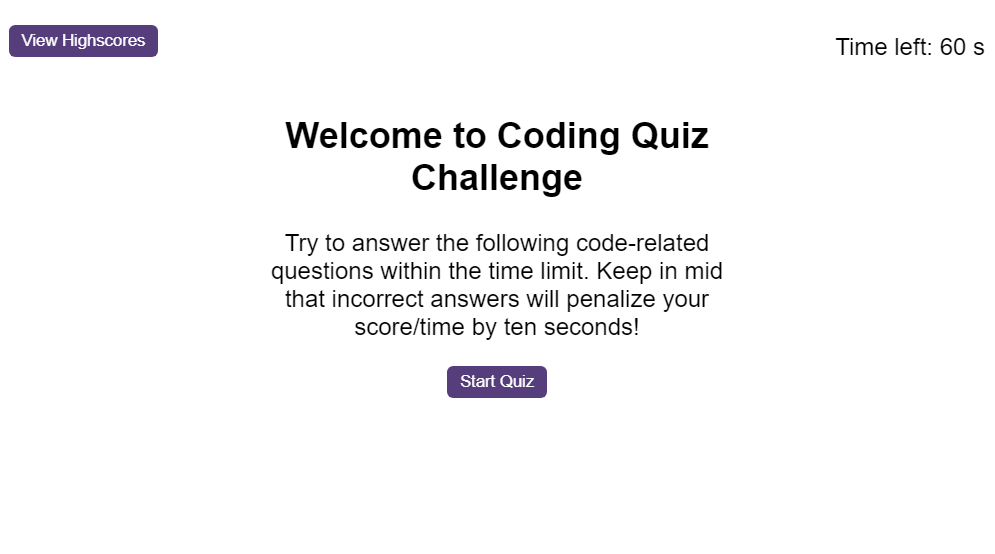
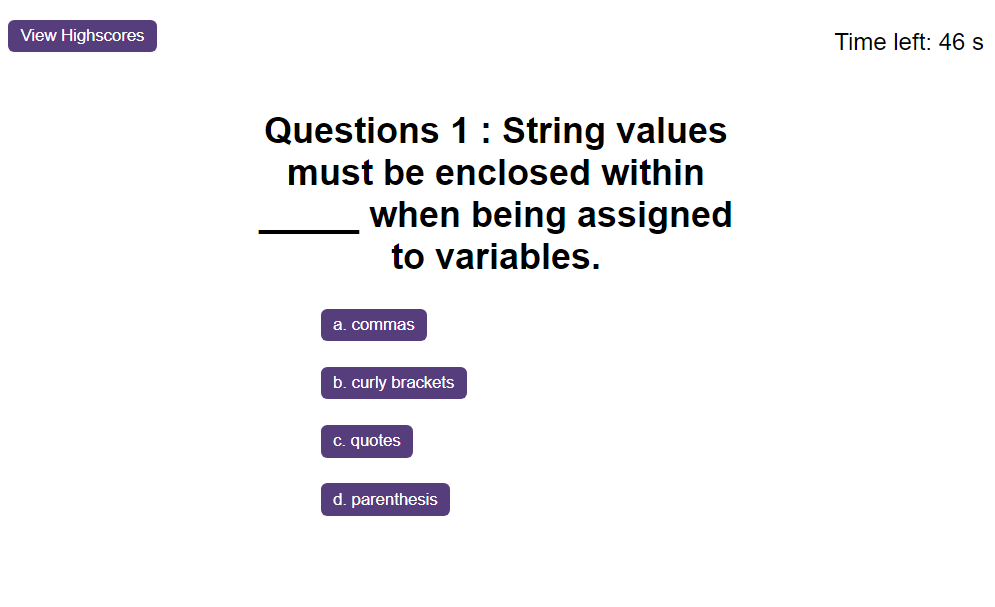
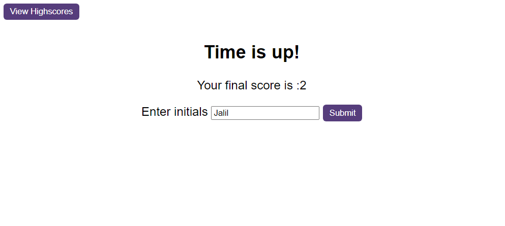
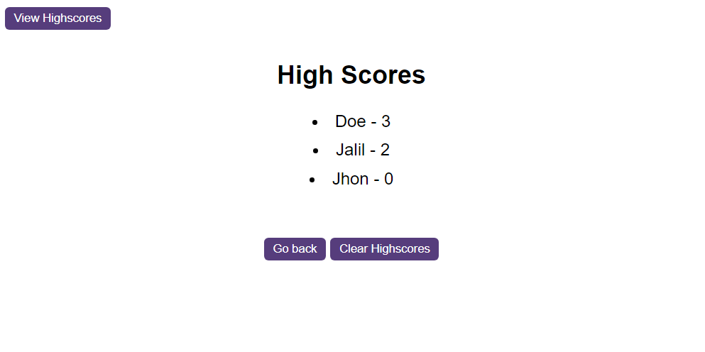

# # Module 6 Challenge: Code Quiz
Bootcamp Module 6 challenge for students

## Description

This Module 6 challenge for bootcamp student was created to push the students to code a Quiz Game that any one can use to play this game. The game start with one question and 4 answers which one of these answers are correct. When you select the correct answer, you will be sent to the next questions and if you pic the wrong answer than the timer will minus your 10 second and you will go to the next question. At the end you scores result will be displayed and you can enter your name to the leaderboard.

## Instructions

The following image shows the web application's appearance and functionality:

![Code Quiz Demo]

* You can start the Game with clikc of Start Quiz button

    * You will be presented with a question and 4 answers.
        * Select the correct answer to go next question

    * When finish answering all the questions or your time up you will be transfer to next page which you can see your final score and enter your name to be saved in the game leaderboard

    * Here you can see the high scores of the players

## Installation

N/A

## Usage

To use this Module 6 Password Generator, you can go to the link of the website and you can see the result.

## Credits

N/A

## License

Please refer to the LICENSE in the repo.